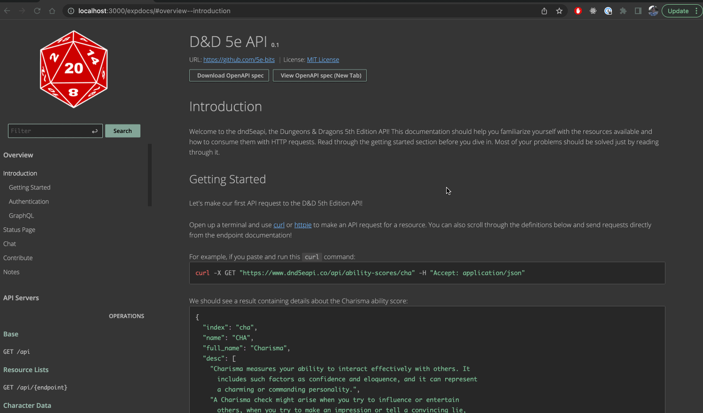

# OpenAPI for the DND API

The `/swagger` directory contains an OpenAPI 3.0 definition for the DND API.

We use the [swagger-cli](https://github.com/APIDevTools/swagger-cli) to validate and bundle
our OpenAPI definition, and [RapiDoc](https://mrin9.github.io/RapiDoc/index.html) as the documentation viewer.

## Current State

In it's current state our OpenAPI documentation is _almost_ an accurate representation of the actual behavior of the API. The first version of these new docs was made based on models and responses defined in the existing documentation. A number of small inconsistencies were discovered that have not been addressed.

### TODO
- [ ] validate schemas against models or actual api responses
- [ ] validate schema and field descriptions are accurate
- [ ] reorganize tag ordering
- [ ] add tag descriptions
- [ ] add section in overview with summary of SRD / OGL
- [ ] add troubleshooting section to overview

## Why OpenAPI?
### Goals

- Improve documentation readability and usability.
- Reduce learning curve when it comes to using the API.
- Make keeping documentation up-to-date easier.

### What is the OpenAPI Specification?

>The OpenAPI Specification (OAS) defines a standard, programming language-agnostic interface description for HTTP APIs, which allows both humans and computers to discover and understand the capabilities of a service without requiring access to source code, additional documentation, or inspection of network traffic. When properly defined via OpenAPI, a consumer can understand and interact with the remote service with a minimal amount of implementation logic. Similar to what interface descriptions have done for lower-level programming, the OpenAPI Specification removes guesswork in calling a service.[^openapi]

[^openapi]: https://github.com/OAI/OpenAPI-Specification/

### What is Swagger?

>Swagger is a set of open-source tools built around the OpenAPI Specification that can help you design, build, document and consume REST APIs.[^swagger]

[^swagger]: https://swagger.io/docs/specification/about/

### Demo

A valid OpenAPI definition gives us a bunch of options when it comes to surfacing docs to end users.

## Documenting an Endpoint

We need 3 pieces to document an endpoint under the OpenAPI spec: 
- [PathItemObject][pathobj]: Describes the operations available on a single path. Defines the shape of parameters, requests, and responses for a particular endpoint.
- [Parameter Object][paramobj]: Describes a single operation parameter. The expected format, acceptable values, and whether the parameter is required or optional.
- [Schema Object][schemaobj]: Describes the definition of an input or output data types. These types can be objects, but also primitives and arrays.

[schemaobj]: https://github.com/OAI/OpenAPI-Specification/blob/main/versions/3.0.3.md#schemaObject

[pathobj]: https://github.com/OAI/OpenAPI-Specification/blob/main/versions/3.0.3.md#pathItemObject

[paramobj]: https://github.com/OAI/OpenAPI-Specification/blob/main/versions/3.0.3.md#parameterObject

## File Organization

>An OpenAPI document MAY be made up of a single document or be divided into multiple, connected parts at the discretion of the user.[^oas_org]

[^oas_org]: An OpenAPI document is a document (or set of documents) that defines or describes an API. An OpenAPI definition uses and conforms to the OpenAPI Specification. An OpenAPI document that conforms to the OpenAPI Specification is itself a JSON object, which may be represented either in JSON or YAML format. https://github.com/OAI/OpenAPI-Specification/blob/main/versions/3.0.3.md#document-structure

The root of our OpenAPI definition lives in `swagger.yml`. This file contains general information about the API, endpoint definitions, and definitions of reusable components. Reference Objects[^oas_ref] are used to allow components to reference each other.

[^oas_ref]: A simple object to allow referencing other components in the specification, internally and externally. https://github.com/OAI/OpenAPI-Specification/blob/main/versions/3.0.3.md#referenceObject

For reusability and readability, definitions are split into 3 directories.
- `/schemas`
    - Each `.yml` file contains definitions of one or more `SchemaObject`. Each schema more or less corresponds to one of the models in the [`src/models` directory](https://github.com/5e-bits/5e-srd-api/tree/main/src/models). We use these schemas to describe the structure of response bodies.
- `/paths`
    - Each `.yml` file contains definitions of one or more `PathItemObject`, where each of those objects defines an operation on an endpoint. Each file more or less corresponds to a controller in the [`src/controllers/api` directory](https://github.com/5e-bits/5e-srd-api/tree/main/src/controllers/api). These objects also include the example response shown in the endpoint documentation.
- `/parameters`
    - Contains definitions of reusable path and query parameters.

Each of those directories contains a file named `combined.yml` consisting of named references to each of the objects defined in sibling `.yml` files in that directory. The `combined.yml` files provides a single source we can reference from other components. By only referencing objects from the `combined.yml` files, we avoid any problems with circular references.
## Developing Locally

There's many possible ways to make changes and view them locally, I'll describe my personal setup and workflow here.

- local copy of the [database](https://github.com/5e-bits/5e-database) running in a custom built docker container on a machine on my local network
- [`redis`](https://redis.io/) running on my laptop
- local copy of the [api](https://github.com/5e-bits/5e-srd-api) running against my local database
    - I start this by running `MONGODB_URI=mongodb://<LOCAL_IP>/5e-database npm start` where `LOCAL_IP` is the ip address of the machine running the database docker container
- [Swagger Viewer](https://marketplace.visualstudio.com/items?itemName=Arjun.swagger-viewer) extension for VSCode
    - be sure to trigger the "Preview Swagger" command from the `swagger.yml` file

### Useful Commands

From the root of the project directory two `npm` commands are available related to these docs.

`npm run validate-swagger`
- checks that the OpenAPI definition in `swagger/swagger.yml` is valid

`npm run bundle-swagger`
- bundles the OpenAPI definition in `swagger/swagger.json` with all the associated referenced files, and writes the file to the `swagger/dist` directory

## Planned Future Improvements

- Generate pieces of documentation based on source code e.g., generate OpenAPI `SchemaObject` from a TypeScript `type` definition.
- Add code snippet examples.
- ...anything you want!

